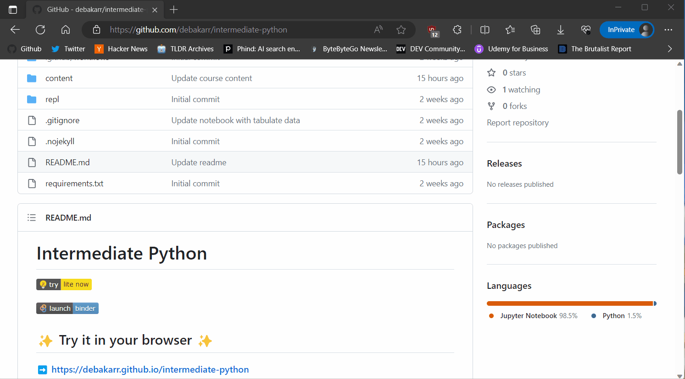
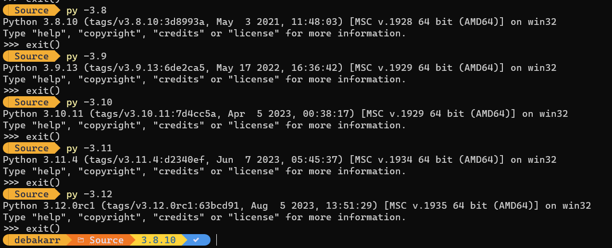
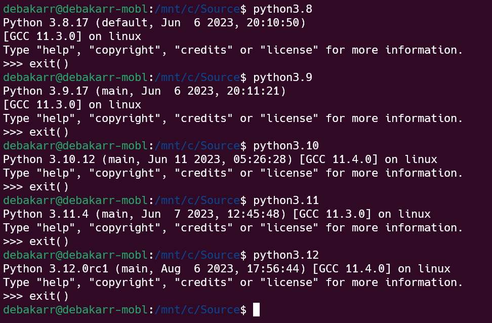

# Intermediate Python

## ✨ Try it in your browser ✨

➡️ **https://debakarr.github.io/intermediate-python**

---

## Try from local environment

1. Make sure you have Python installed. Follow the guide in the official Python documentation on how to do it for different operating systems: [Windows](https://docs.python.org/3/using/windows.html#installation-steps), [Mac](https://docs.python.org/3/using/mac.html#getting-and-installing-macpython), or [Unix](https://docs.python.org/3/using/unix.html#getting-and-installing-the-latest-version-of-python) systems. 
2. Considering you have Git installed. Try cloning this repository: `git clone https://github.com/debakarr/intermediate-python.git`
3. I would recommend creating a `virtual environment` to install the dependencies: `python -m venv .venv`
4. Activate virtual environment: On Windows `.venv\Scripts\activate` and on Linux `source .venv/bin/activate`
5. Install all the dependencies in the virtual environment: `pip install -r requirements.txt`
6. Run Jupyter Lab: `jupyter lab`

---
This course is targeted for developers who have already beginner experience with Python and want to level up to intermediate to advance level.

Course is delivered by **Roy, Debakar**.

## Expectation/Pre-requisite

You should already have knowledge of:
- Python fundamentals (identifier, data types, loops, functions, OOP) is assumed.
- If you are new to Python, consider completing a beginner Python course first.
- We assume that we are on Python 3.8+
- Git (In case you want to clone this repo and run it locally).

## What can you expect?

- Dive deeper into intermediate and somewhat advanced Python concepts and topics.
- Gain a comprehensive understanding of intermediate Python features.
- Explore real-world applications of intermediate Python concepts.

## Which Python version are we using?

<strong>Python3.8+</strong>

| Branch | Schedule                                       | Status        | First release | End of life  | Release manager       |
| ------ | ---------------------------------------------- | ------------- | ------------- | ------------ | --------------------- |
| main   | [PEP 719](https://peps.python.org/pep-0719/)   | feature       | _2024-10-01_  | _2029-10_    | Thomas Wouters        |
| 3.12   | [PEP 693](https://peps.python.org/pep-0693/)   | prerelease    | _2023-10-02_  | _2028-10_    | Thomas Wouters        |
| 3.11   | [PEP 664](https://peps.python.org/pep-0664/)   | bugfix        | 2022-10-24    | _2027-10_    | Pablo Galindo Salgado |
| 3.10   | [PEP 619](https://peps.python.org/pep-0619/)   | security      | 2021-10-04    | _2026-10_    | Pablo Galindo Salgado |
| 3.9    | [PEP 596](https://peps.python.org/pep-0596/)   | security      | 2020-10-05    | _2025-10_    | Łukasz Langa          |
| 3.8    | [PEP 569](https://peps.python.org/pep-0569/)   | security      | 2019-10-14    | _2024-10_    | Łukasz Langa          |
| ~3.7~  | ~[PEP 537](https://peps.python.org/pep-0537/)~ | ~end-of-life~ | ~2018-06-27~  | ~2023-06-27~ | ~Ned Deily~           |

<a href="https://devguide.python.org/versions/">Source for the above table</a>

## Running different Python version in Windows

## Running different Python version in Linux

